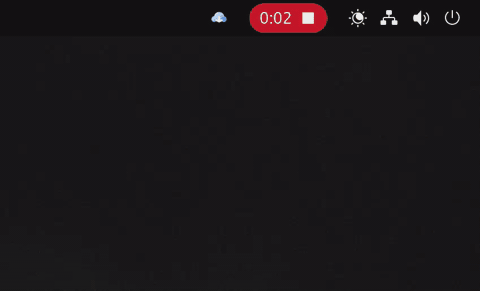
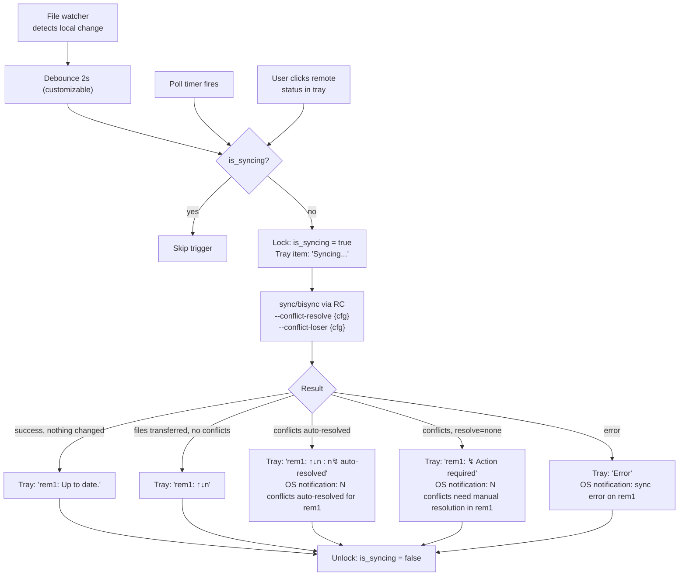

<h1>
   
  sync-watch
</h1>

- Rclone Wrapper written in Rust; Handles file watching and remote polling. 
- Manages Rclone remotes like a native cloud sync-client. 
- Provides a system tray interface for status and manual sync triggers.

## Features 

- This activity diagram encapsulates the whole logic of sync-watch, using "rem1" as
an example remote:

## Dependencies

## Installation
- Prerequisite: [Rclone](https://rclone.org/downloads/) must be installed.

## Development Setup

## Limitations
